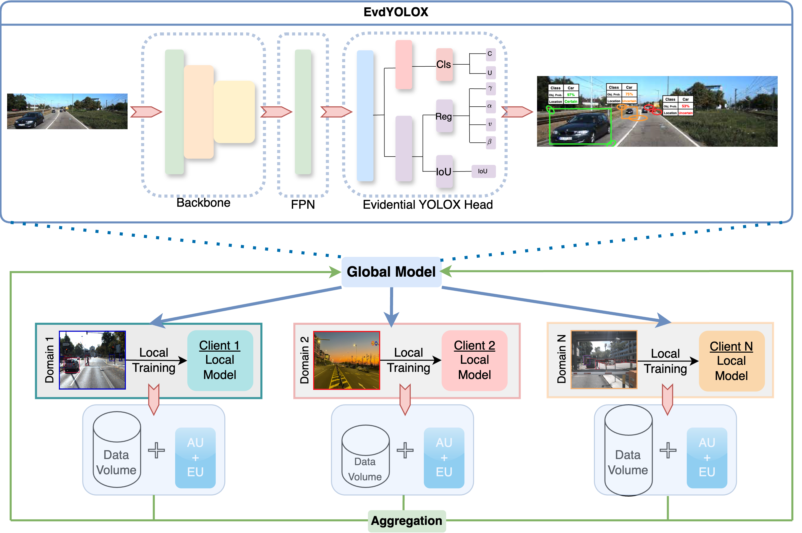
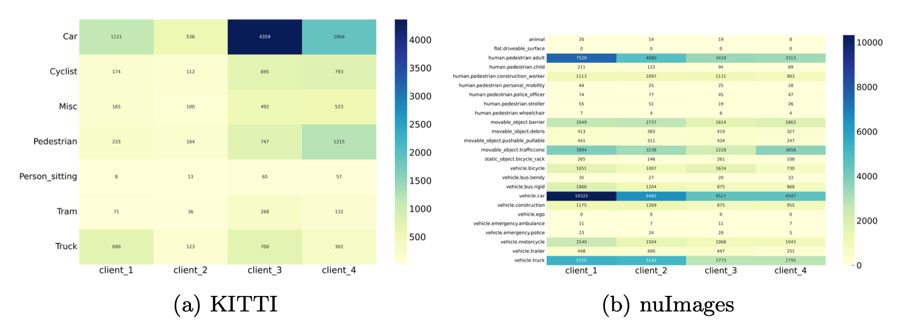
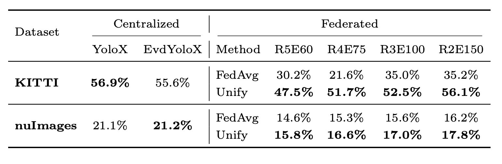
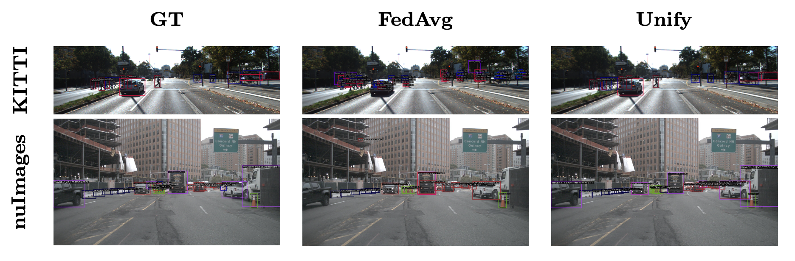

# Unify: Uncertainty incorporated Federated Learning for Object Detection

## Introduction
This repository contains the official implementation of the paper "**Unify**: **Un**certainty **I**ncorporated **F**ederated Learning for Object Detection", which has been submitted to the **ARCS 2025 conference**.

We introduce Unify, a novel Federated Learning (FL) framework that incorporates Evidential Learning (EL) to enhance robustness and performance in object detection under decentralized and heterogeneous conditions. By integrating epistemic and aleatoric uncertainty estimation into the model aggregation process, Unify achieves adaptive weighting of client updates, leading to improved cross-domain generalization and more reliable predictions.

The framework is built upon a lightweight YOLOX detector, which has been extended with Evidential Learning for uncertainty-aware object detection in federated settings. Evaluations on the KITTI and nuImages datasets demonstrate that Unify outperforms standard FedAvg in non-IID conditions, significantly improving mean Average Precision (mAP) while maintaining model uncertainty calibration.

## Requirements
To install all the requirements, one needs to first install:

+ conda
+ poetry
+ flower

A detailed list of the required libraries can be found in:

+ poetry.toml

The proper installation must then be done with poetry and conda.

## Data Splitting Strategy
To simulate a realistic federated learning scenario with heterogeneous data, we partition the KITTI and nuImages datasets into four clients, ensuring a non- i.i.d. distribution of object categories. Some clients predominantly contain vehi- cles (e.g., car, truck), while others have more pedestrians or cyclists, reflecting real-world data silos due to different road environments and sensor placements.

 (a) The KITTI dataset primarily consists of categories such as vehicles, pedestrians, and cyclists, with relatively simple data partitioning. (b) The nuImages dataset has a larger variety of categories, leading to more complex client data distributions.

 ## Experiments & Results
 We evaluate Unify on KITTI and nuImages datasets under multiple federated configurations. 

 

As a result, Unify facilitates a more stable global model evolution, effectively integrating the strengths of each client while mitigating their limitations.

 ## Qualitative Results
 Below are sample detection results from Unify vs. FedAvg:

 

## Authors and acknowledgment
- [Shang Gao](mailto:sgao@uni-kassel.de) 

## License
We use the MIT license, see

+ LICENSE

## Citation